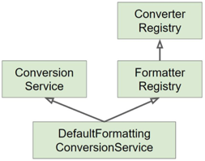

# 스프링 핵심기술 (2편)
 

# Resource 추상화
- java.net.URL을 org.springframework.core.io.Resource로 감싼 것.(추상화 한 것.)
- 스프링 내부에서 많이 사용하는 인터페이스.
- 기존 java.net.URL은 classpath 기준으로 리소스를 가져오는 기능이 없었음.
- org.springframework.core.io.Resource에서는 여러가지 prefix를 지원. (http, ftp, https 등)

### 추상화한 이유
- 클래스패스 기준으로 리소스 읽어오는 기능 부재.
- ServletContext를 기준으로 상대 경로로 읽어오는 기능 부재.
- 새로운 핸들러를 등록하여 특별한 URL 접미사를 만들어 사용할 수는 있지만 구현이 복잡하고 편의성 메소드가 부족하다.

### Resource 인터페이스의 메소드
- getInputStream()
- exist()
- isOpen()
- getDescription(): 전체 경로 포함한 파일 이름 또는 실제 URL.

### Resource 구현체
(1) UrlResource: java.net.URL 참고, 기본으로 지원하는 프로토콜 http, https, ftp, file, jar.  
(2) ClassPathResource: 지원하는 접두어 'classpath:'  
(3) FileSystemResource  
(4) ServletContextResource: 웹 애플리케이션 루트에서 상대 경로로 리소스 찾는다.  
> 주로 WebApplicationContext의 구현체인 GenericWebApplicationContext를 사용하기 때문에 
이에 해당하는 ServletContextResource를 많이 사용하게 된다. 
(Resource의 타입은 ApplicationContext의 타입에 따라 결정된다.) 

### 리소스 읽어오기
Resource의 타입은 location 문자열과 ApplicationContext의 타입에 따라 결정된다. 
 
● ClassPathXmlApplicationContext -> ClassPathResource  
● FileSystemXmlApplication -> FileSystemResource  
● WebApplicationContext -> ServletContextResource  
 
ApplicationContext의 타입에 상관없이 리소스 타입을 강제하려면  
java.net.URL의 접두어 혹은 'classpath:'를 사용할 수 있다.  
 
● classpath:sombrero/config.xml -> ClassPathResource  
● file:///sombrero/config.xml -> FileSystemResource  
 
<pre>
var ctx = new ClassPathXmlApplicationContext("test.xml");
/**
 * 위의 test.xml는 추상화된 ClassPathResource로 내부적으로 변환이 된다.
 * ClassPathXmlApplicationContext는 클래스패스를 기준으로 리소스를 찾는다.
 * 위의 test.xml는 'classpath:test.xml'과 같다.
 */

var ctx2 = new FileSystemXmlApplicationContext("/src/main/resources/test.xml");
/**
 * 위의 test.xml는 추상화된 FileSystemResource로 내부적으로 변환이 된다.
 * FileSystemXmlApplicationContext는 파일시스템 기준으로 리소스를 찾는다.
 */
</pre>
** 대부분은 어떤 ApplicationContext를 사용하는지 알기 어렵기 때문에 **_명시적으로 접두어를 쓰는 것을 권장._**  
그리고 ServletContextResource는 웹 애플리케이션 루트부터 찾는데 
스프링부트의 내장형 톰캣에는 context path가 지정되어 있지 않다. 따라서 리소스를 찾을 수 없다. 
때문에 이와 관련해서도 역시나 'classpath:'와 같이 접두어를 사용하는 것을 권장한다. 

=> sombrero.abstraction_resource 패키지 참조. 

  

# Validation 추상화
- org.springframework.validation.Validator
- 애플리케이션에서 사용하는 객체 검증용 인터페이스.

### Validation 특징
- 어떠한 계층과도 관계가 없다. => 모든 계층(웹, 서비스, 데이터)에서 사용해도 좋다.
- 구현체 중 하나로, JSR-303(Bean Validation 1.0)과 JSR-349(Bean Validation 1.1)을 지원한다.
(LocalValidatorFactoryBean)
- DataBinder에 들어가 바인딩 할 때 같이 사용되기도 한다.

#### ** Bean Validation 이란
Java 표준 스펙 중 하나. 
빈에 있는 데이터를 검증할 수 있는 기능. 
 

### Validation 인터페이스
- boolean supports(class clazz): 검증할 수 있는 클래스인지 확인하는 메소드. 
어떤 타입의 객체를 검증할 때 사용할 것인지 결정함. 
- void validate(Object obj, Errors e): 실제 검증 로직을 이 안에서 구현. 
구현할 때 ValidationUtils 사용하며 편리함. 

### 스프링 부트 2.0.5 이상 버전을 사용할 때
- LocalValidatorFactoryBean 빈으로 자동 등록.
- JSR-380(Bean Validation 2.0.1) 구현체로 hibernate-validator 사용.
- https://beanvalidation.org

=> sombrero.abstraction_validation 패키지 참조. 

  

# 데이터 바인딩 추상화

### 데이터 바인딩
어떤 프로퍼티 값을 타겟 객체에 설정하는 기능. 
사용자가 입력하는 값을 애플리케이션 도메인 객체에 동적으로 할당하는 기능. 
사용자가 입력하는 값은 주로 문자열인데 그 문자열을 객체가 가지고 있는 다양한 프로퍼티 타입(int, long, Boolean, Date 등) 
혹은 Event, Book과 같은 도메인 타입으로 변환해서 넣어주는 기능. 
> 예전의 ApplicationContext xml 설정을 사용했을 때 xml에 설정한 문자열을 빈이 가지고 있는 적절한 타입으로 변환해서 넣어줄때도 사용. 
> SpEL(Spring Expression Language)에서도 사용. 

## 스프링 3.0 이전
### PropertyEditor (스프링 3.0 이전)
- 스프링 3.0 버전 이전까지 사용하던 인터페이스.
- 스프링 3.0 이전까지 DataBinder가 변환 작업에 사용하던 PropertyEditor 인터페이스.
- org.springframework.validation.DataBinder 인터페이스를 통해 PropertyEditor를 사용.
- 스레드-세이프 하지 않음. (상태 정보를 저장하고 있음. 따라서 싱글톤 빈으로 사용하면 안됨.)

> ** 주의!!  
PropertyEditor가 받은 객체를 getValue()로 가져올 수 있음. 
PropertyEditor가 가지고 있는 값은 서로 다른 스레드끼리 공유가 됨. (stateful(상태 유지), 상태 정보를 저장하고 있음.) 
스레드-세이프 하지 않음. 
때문에 PropertyEditor는 빈으로 등록하면 안됨. (여러 스레드가 공유하도록 사용하면 안됨.) 
(1번 회원이 2번 회원의 정보를 변경하고, 2번 회원이 1번 회원의 정보를 변경하는 일이 발생.) 
때문에 절대로 PropertyEditor는 빈으로 등록해서 쓰면 안됨. 
(한 스레드에서만 유효한 thread scope의 빈으로 만들어서 사용하는 것은 가능.) 
- Object와 String 간의 변화만 할 수 있어서 사용 범위가 제한적임.

=> sombrero.abstraction_data_binding.before_spring_3_0 패키지 참조. 

## 스프링 3.0 이후
### Converter와 Formatter (스프링 3.0 이후)

### Converter
S 타입을 T 타입으로 변환할 수 있는 매우 일반적인 변환기. 
상태 정보 없음.(Stateless) 
스레드-세이프하기 때문에 빈으로 등록할 수도 있다. 
보통은 빈으로 등록하지 않고 ConverterRegistry에 등록해서 사용. 

### Formatter
Object와 String 간의 변환을 담당한다. 
문자열을 Locale에 따라 다국화하는 기능도 제공한다. (optional) 
스레드-세이프하기 때문에 빈으로 등록할 수도 있다. 
보통은 빈으로 등록하지 않고 FormatterRegistry에 등록해서 사용. 

=> sombrero.abstraction_data_binding.after_spring_3_0 패키지 참조. 

### ConversionService

- ConversionService를 통해 Converter와 Formatter를 사용. 
(Converter와 Formatter가 ConversionService에 등록된다.) 
- 실제 변환 작업은 이 인터페이스를 통해서 스레드-세이프하게 사용할 수 있음.
- 스프링 MVC, 빈(value) 설정, SpEL에서 사용한다.
- DefaultFormattingConversionService가 
FormatterRegistry 기능도 하고, ConversionService 기능도 하고, 
여러 기본 Converter와 Formatter를 등록해줌. 
(DefaultFormattingConversionService 클래스가 FormatterRegistry와 ConversionService 인터페이스 모두 구현.) 

 

#### ** 스프링부트에서는..
웹 애플리케이션인 경우에 DefaultFormattingConversionService를 상속하여 만든 
**_WebConversionService_** 를 빈으로 등록해준다. 
WebConversionService는 DefaultFormattingConversionService를 상속해서 만든 클래스이기 때문에 좀 더 많은 기능을 가지고 있다. 
=> sombrero.abstraction_data_binding.after_spring_3_0.AppRunner5 클래스 참조. 

  

